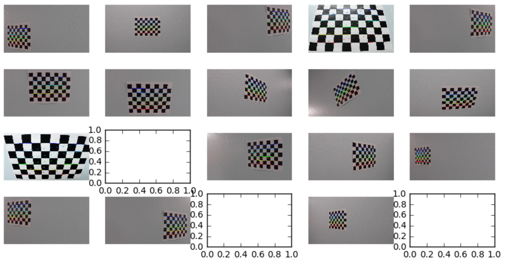
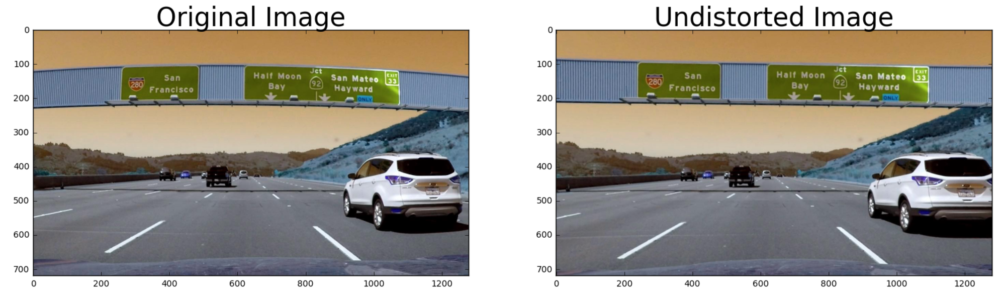
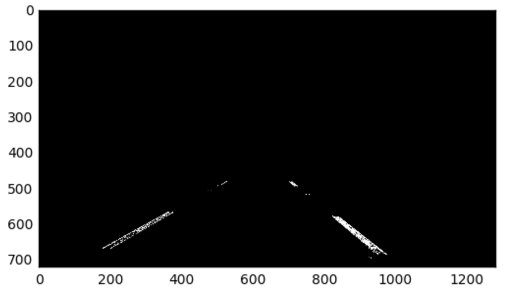
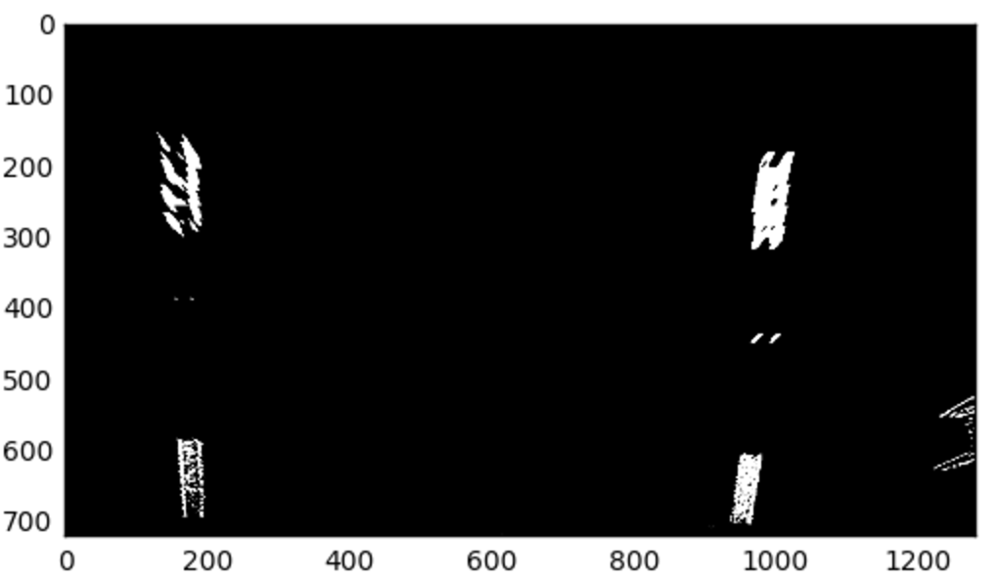
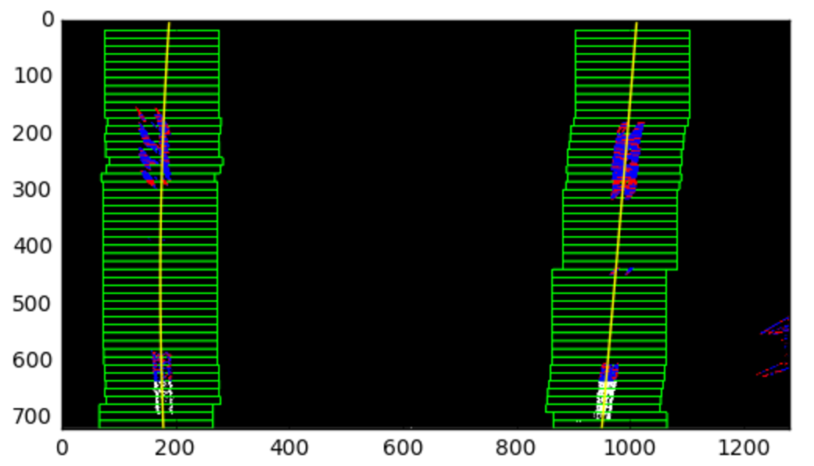
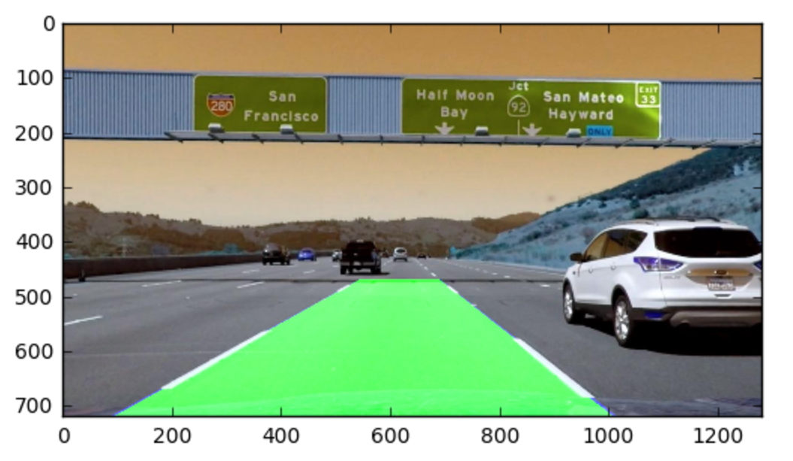

## Advanced Lane Finding
[](http://www.udacity.com/drive)


In this project, your goal is to write a software pipeline to identify the lane boundaries in a video. The pipeline uses traditional computer vision techniques whereby images are calibrated against distorsion and utilize perspective transform techniques to detect lanes


The Project
---

The goals / steps of this project are the following:

* Compute the camera calibration matrix and distortion coefficients given a set of chessboard images.
* Apply a distortion correction to raw images.
* Use color transforms, gradients, etc., to create a thresholded binary image.
* Apply a perspective transform to rectify binary image ("birds-eye view").
* Detect lane pixels and fit to find the lane boundary.
* Determine the curvature of the lane and vehicle position with respect to center.
* Warp the detected lane boundaries back onto the original image.
* Output visual display of the lane boundaries and numerical estimation of lane curvature and vehicle position.

### Scripts

* video_generation_pipeline.py: Script to generate the lane tracking video (requires image_processing_pipeline.py, tools_threshold_histogram.py, tools_drawing.py).
* image_processing_pipeline.py: Script utilized by video generation pipeline to detect lanes on each image.
* tools_threshold_histogram.py: Script used by image processing pipeline for generating binary thresholded images and also calcute pixel histogram for the image.
* tools_drawing.py: Drawing tools for plotting lanes on the original image.
* project_output_color.mp4 : Lane tracking output from the pipeline.
* project_video.mp4: Video used for testing lane tracking. 


### Image Calibration

I utilized inbuilt functions of opencv to generate calibration matrix and distortion coefficients. Example of calibration parameters is shown below:

 

### Distortion Correction

The next step was applying distortion correction to raw image. I utilzed the calibration matrix to generate undistorted image from raw images. Example shown Below:

 

### Create Binary image using color/gradient Transform

I played with different gradients and color transform to get the best possible edge detection especially the lanes. I utilized sobel gradient calculated in X direction only, Y direction only, combination of both, directional parameters and saturation component after transforming image from RGB space to HSL space. The parameters and the combination that gave the best possible results were

```
xgrad_thresh_temp = (40,100)
s_thresh_temp=(150,255)
```

Example of experiments using different threshold for different techniques is shown below:


### Apply Perspective transform to rectify binary image

Next step in the image processing pipeline was to transform to the binary threshold image to a perspective image to get the bird-eye view. To do so I firstly masked the image to get rid of all the noise around the lane and keep only the lanes left in the image. After masking the image, I transformed the image using in built function of OpenCV. Example of the masked and the corresponding image is shown below:




### Utilize pixel histogram to detect lane

Last step towards the experiment was to detect lane from the perspective image. I utilized pixel histogram technique as described in the lecture to detect the region of lane and then fitted a second degree polynomial to fit line through the most likely region were the lanes is. Example of the lane detection and line fitting is shown below:



### Project the lane detection from perspective image to original image 

The last step was to project the detected lane in perspective image back to the original image. I utilized the inverse projection to perform this step. The final lane tracking on the original image is shown below. 



Thanks to numerious articles my pkern, acfillipo that helped me to gett the correct drawing tools in place.

### Self Reflection

Working on this project has by far been one of the best hands on experience with lots of core OpenCV functionality and has helped me improve my understanding of core computer vision techniques. Putting this end to end pipeline to work has been challenging and fun at the same time. 

I have not been able to get my proposed pipeline to work harder_challenge_video. Its doesn't work that well. Few things which might help mitigate that problem can be:

* develop technique to incorporate sharper curve
* developing techniques to incorporate better handling of brightness.